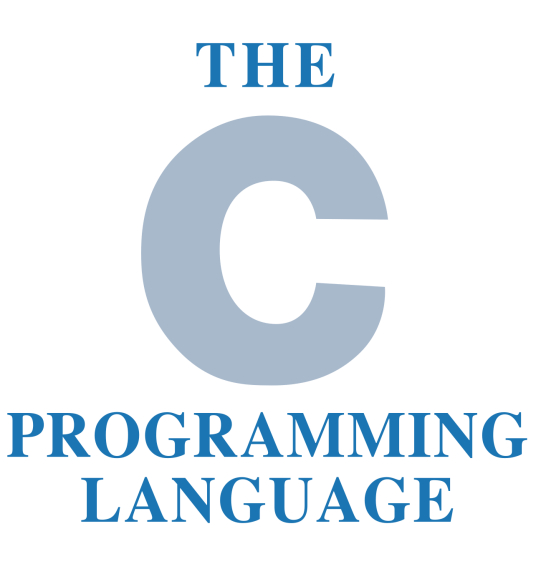
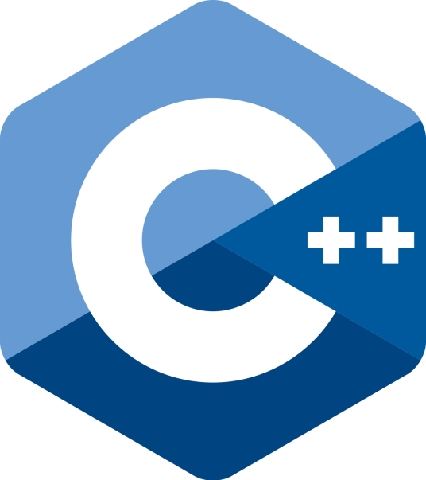
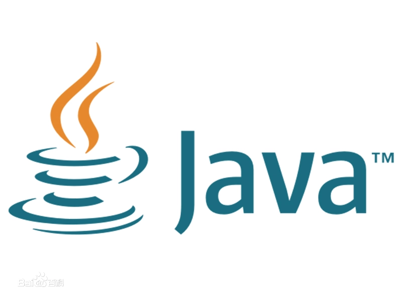

# Java语言简述

最后修改于2022.03.15

## Java的诞生

传说，在1972年的某一天，一个叫做**丹尼斯·里奇**的男人在~~电话实验室~~贝尔实验室里发明出来了一个新秀（也是现在的老大哥）——`C语言`。这是一门面向过程的全新语言，也是目前最贴近于硬件的高级语言。

这门语言十分滴好用，但是大家用久了，就开始了抗议：

> 我们这些普通的程序员，哪里要学这么多和硬件有关的知识啊？我们要一种面向对象的、容易理解的、贴近于软件层面的语言！

于是乎，有个叫做**本贾尼·斯特劳斯特卢普**的人又来到了~~电话实验室~~这里，发明了一种船新的语言：`C++`。

大家还是一时用一时爽，一直用就不爽了。Linux之父**Linus Torvalds**就曾对C++做出过这样的评价：

> C++ 是一门很烂的语言。

是的，他觉得C++反倒是负优化，所以他编写出来的分布式版本控制系统git全是用C编写的，他还因此与一个叫做 Dmitry 的人闹掰了，将C++批的一无是处，感兴趣的朋友可以看一下[这篇文章](https://blog.csdn.net/best_xiaolong/article/details/115911391)。

大家觉得C++不好的主要原因就是里面的一些东西太杂了，于是，大家就很想开发一种跨平台、可移植的面向对象编程语言。（所谓C++--）

1992年的夏天（刚好离C的问世过去了20年），一个闻所未闻的叫做Sun的小公司发布了一门毫无名气的语言：`Oak`，也就是Java的前身。由于当时这门语言太新了，硬件厂商都觉得没把握，就没有流行起来。

1995年，互联网发展的愈发蓬勃，业界为了能让死板、单调的网页“灵活”起来，急需一种新的软件技术，这种程序能够通过网络传播并且能够跨平台运行（~~船新的病毒~~）。于是，世界各个IT巨头都投入了大量的人力、物力和财力。此时此刻，Sun公司想起了那个在墙角里积灰的Oak，它刚好符合这些要求。Sun公司立刻去申请商标，却发现Oak这个名字已经被人使用了。

Sun公司一想，既然如此，就用我们最喜欢的一种咖啡来做这门语言的名字吧！没错，这门语言就是我们的主题：`Java`。

因此，1995年5月23日应该是一个划时代的时刻，Sun公司在自己的发布会上面发布了Java这门语言和HotJava浏览器（一种支持Java的浏览器，现在的浏览器都支持了）。IBM、Apple、DEC、Adobe、HP、Oracle、Netscape和Microsoft等各大公司纷纷停止了自己相关的项目，抢购Java的商业使用权，并且为自己的产品开发了Java的平台。1996年1月，Sun公司也发布了JDK1.0，为Java接下来的发展打下了基础。

至此，Java就如同天选之人般诞生在了这个世界上。

## Java为什么能够成功？

Java拥有许多绝妙的特性与优势，比如：

- 简单性

- 面向对象

- 可移植性

- 高性能

- 分布式

- 动态性

- 多线程

- 安全性

- 健壮性

这些优势都是Java能在计算机世界里取胜的关键。

Java的简述这一部分我们就讲完了，下次我们来讲Java的三大版本，大家要多多支持哈(-_-)

